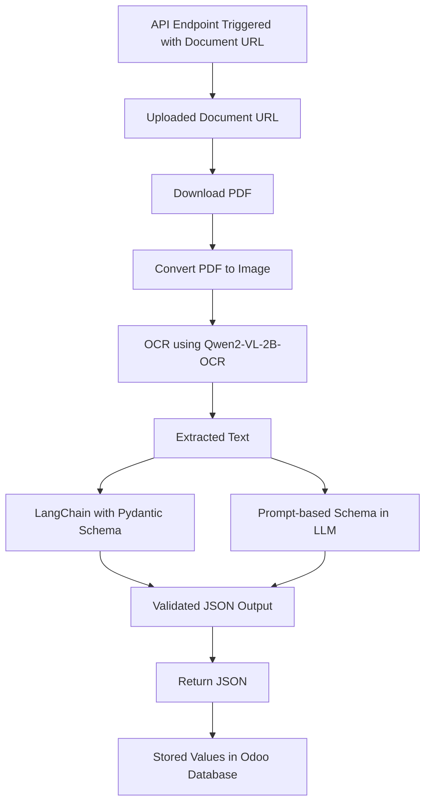

# 🧠 AI Document Schema Extractor

A production-grade Python pipeline to extract structured data from employee-related PDF documents using OCR and LLMs. The system takes a **document URL**, performs **OCR**, and extracts **schema-aligned JSON** using **LangChain** + **LLMs** or **prompt-engineered extraction**.

✅ **Already integrated with [Odoo ERP](https://www.odoo.com/)** for real-world employee document automation.

---

## 🚀 Project Overview

This project automates information extraction from various employee-related documents (e.g., passports, visas, employment contracts, change status, residence permits, healthcare certifications). It processes document URLs (uploaded via Odoo) and returns structured data in JSON format using two robust pipelines:

* ✅ **OCR + LLM (via LangChain) with Pydantic schema validation**
* ✅ **OCR + Prompt-based schema extraction using LLM**

---

## 🔗 Odoo Integration

This project is **fully integrated with Odoo** and works directly with document uploads from the Odoo backend. Documents are uploaded and stored in the system, and their **URLs are passed to the extractor** for:

* Automated document processing
* Field extraction for employee onboarding
* JSON output compatible with Odoo modules
* Easy API-level integration for HR, admin, and payroll operations

> ✅ **Ready to plug into your Odoo HR or Document Management workflow**

---

## 📄 Document Flow



---

## 🧰 Technologies Used

| Component             | Tool/Library                                              |
| --------------------- | --------------------------------------------------------- |
| **OCR**               | [Qwen2-VL-2B-OCR](https://huggingface.co/Qwen/Qwen-VL-2B) |
| **LLM Providers**     | OpenAI, DeepSeek, Ollama, Groq, etc.                      |
| **LLM Framework**     | [LangChain](https://www.langchain.com/)                   |
| **Schema Validation** | [Pydantic](https://docs.pydantic.dev/)                    |
| **PDF Handling**      | PyMuPDF (`fitz`), PIL                                     |
| **HTTP Client**       | `requests`                                                |

---

## 📦 Project Structure

```
Ai_Document_Extractor/
├── ai_data_detector/
│   ├── __init__.py
│   ├── config.py
│   ├── load_model.py
│   ├── read_pdf.py
│   ├── schema_extractor.py  # Using LangChain with Pydantic Schema and LLM
│   ├── schema_output.py
│   ├── schemas.py
├── setup.py
├── pyproject.toml         # (optional)
├── README.md              # (recommended)
├── requirements.txt       # (optional but helpful)
└── .gitignore             # (optional)

```

---

## ✅ Supported Document Types

| Document Type             | Extracted Fields                                                            |
| ------------------------- | --------------------------------------------------------------------------- |
| Passport                  | Passport number, name, DOB, issue/expiry date, profession                   |
| Visa (Tourism/Employment) | UID number, name, DOB, nationality, passport, profession, issue/valid dates |
| Change Status             | UID number, name, passport, employer, nationality, stamping deadline        |
| Employment Contract       | Contract duration, nationality, passport, DOB, academic qualification       |
| Residence                 | ID number, name, passport, profession, issue/expiry date                    |
| Healthcare Certificate    | DHA Unique ID, Professional name                                            |

---

## 🔧 How It Works

### 1. **Input**

A URL pointing to a PDF document uploaded in the backend (e.g., Odoo, ERP, HR system).

### 2. **Processing**

* The PDF is fetched and converted to images.
* Images are passed through `Qwen2-VL-2B-OCR` to extract raw text.
* OCR output is then passed to one of the following:

#### Approach 1: LangChain + Pydantic Schema

* LangChain prompts the LLM and parses the output into a validated schema using `Pydantic`.

#### Approach 2: Prompt-Based Schema

* The entire schema logic is embedded in the prompt.
* LLM returns structured JSON as response.

---

## 🧪 Example Output

```json
{
  "document_type": "Passport",
  "passport_details": [
    {
      "passport_number": "123456789",
      "name": "John Doe",
      "date_of_birth": "01/01/1990",
      "date_of_issue": "01/01/2020",
      "date_of_expiry": "01/01/2030",
      "profession": "Engineer"
    }
  ]
}
```

---


## 🚀 Installation & Usage

### 1. Clone the Repository

```bash
git clone https://github.com/Mohammedkh97/Machine-Learning-Projects.git
cd Machine-Learning-Projects/Ai_Document_Extractor
```

### 2. Create and Activate a Virtual Environment (Optional but Recommended)

```bash
python3 -m venv venv
source venv/bin/activate  # On Windows use: venv\Scripts\activate
```
### 3. 🧩 Requirements

Install the required dependencies:

```bash
pip install -r requirements.txt
```

### 4. Install the Package

Install the package locally in *editable* mode:

```bash
pip install -e .
```

This installs the `ai-extract` CLI tool and all required dependencies.

---

## 🧠 Usage 

### ➤ Run via Command-Line Interface (CLI)

Once installed, you can run the extractor using:

```bash
ai-extract <PDF_URL_1> <PDF_URL_2> ...
```

Example:

```bash
ai-extract https://example.com/doc1.pdf https://example.com/doc2.pdf
```

This command will:

* Download each PDF from the URL
* Convert the PDF to image(s)
* Run OCR using **Qwen2-VL-2B-OCR**
* Extract structured data using **LangChain + LLM**
* Save a `.json` output for each document

---

## 🛠 Environment Variables

Make sure to create a `.env` file in the root directory to provide your LLM credentials:

```env
OPENAI_API_KEY=your_openai_key
# or
GROQ_API_KEY=your_groq_key
```


Then, run the extractor via CLI:

```bash
ai-extract
```

---

## 🔐 API Key Configuration

- Set your LLM API key in the `.env` file or use the `get_api_key()` from `config.py`.
- Supports OpenAI, DeepSeek, Groq, Ollama, etc.


---

## Notes
I'm using two approches to get the output schema:

1. Through the Pydantic Schema with langChain framework.
2. Through schema built-in the prompt and feeding into LLM.

You can select between them and try through the setup file and re-run the same command to install the update the package dependecies.
```
pip install -e 
```
---


## 👨‍💻 Author

* **Mohammed Khalaf**
  >* Embedded & AI Developer

[GitHub](https://github.com/Mohammedkh97) | [LinkedIn](https://www.linkedin.com/in/mohammed-khalaf97/)
